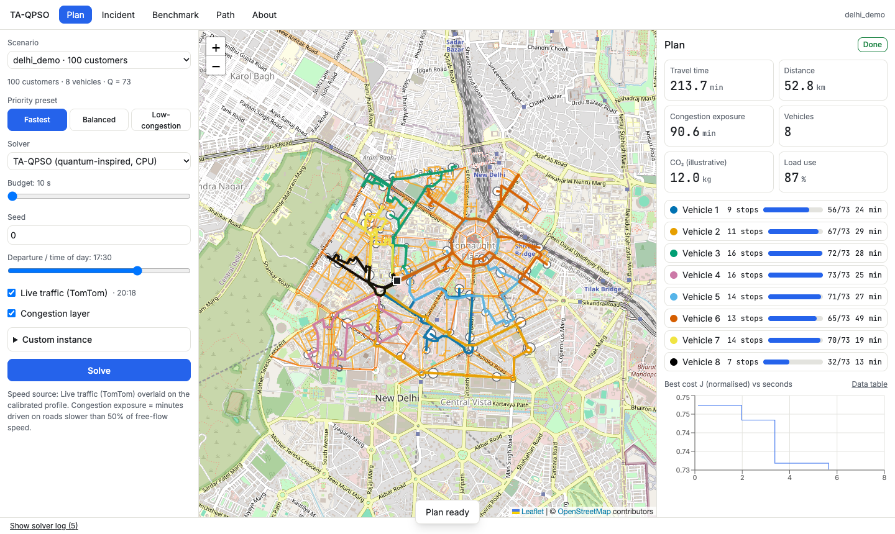

# Tempo — Traffic-Aware Vehicle Routing (TA-QPSO)

**Smart India Hackathon 2026 · Problem Statement 26137 (Egreen Quanta) · Software · Transportation & Logistics**

Tempo plans delivery routes for a fleet of vehicles on a **real Delhi road network**, using travel
times that **change with the time of day**, and **re-plans within a second** when a road is blocked.
The optimiser is **TA-QPSO** (Traffic-Aware Quantum-behaved Particle Swarm Optimisation), benchmarked
fairly against classical metaheuristics, an industrial solver and exact methods.

> **What "quantum-inspired" means here.** TA-QPSO is *classical* computation: it borrows the
> sampling rule of Quantum-behaved PSO and runs on an ordinary CPU. No quantum hardware is used and
> no quantum speedup is claimed. Every number in this README comes from a saved run record, and
> losses are reported alongside wins.



---

## Contents
1. [The problem](#1-the-problem)
2. [What we built](#2-what-we-built)
3. [How it works](#3-how-it-works)
4. [Results at a glance](#4-results-at-a-glance)
5. [Run it](#5-run-it)
6. [Demo walkthrough](#6-demo-walkthrough)
7. [API](#7-api)
8. [Repository layout](#8-repository-layout)
9. [Reproducing the results](#9-reproducing-the-results)
10. [Limitations](#10-limitations)
11. [Documentation index](#11-documentation-index)

---

## 1. The problem

Urban delivery fleets (e-commerce, pharmacy, food distribution) usually plan on **static** travel
times, but in a city like Delhi a 10 km trip takes about 15 minutes at 3 a.m. and over 30 minutes at
6 p.m. Roads also close without warning. The Capacitated Vehicle Routing Problem (CVRP) is NP-hard,
so practical systems rely on heuristics.

The problem statement asks for a quantum-inspired metaheuristic (QPSO family) on a weighted road
graph that:
- minimises travel time, distance and congestion,
- is benchmarked against classical and exact methods,
- scales to smart-city logistics.

## 2. What we built

A full-stack web platform (Python solver + FastAPI backend + React dashboard):

| Capability | Details |
|---|---|
| **Real road graph** | OpenStreetMap extract of central Delhi (Connaught Place zone) via OSMnx |
| **Time-of-day traffic** | 96 × 15-minute speed slots per road class, calibrated to the TomTom Traffic Index 2025 hourly profile for New Delhi (labelled *calibrated synthetic*) |
| **FIFO-safe travel times** | Ichoua–Gendreau–Potvin (IGP) model: a vehicle leaving later never arrives earlier. Checked on every pair; the build fails if it doesn't hold |
| **TA-QPSO solver** | Random keys → TD-Split → Variable Neighbourhood Descent → write-back → QPSO update; anytime, streams best-so-far live |
| **Priority presets** | *Fastest*, *Balanced*, *Low-congestion* (normalised weighted objective) |
| **Incident re-planning** | Draw a blockage or slowdown on the map → safe plan in **< 0.08 s**, then a warm-started re-optimisation streams in |
| **Fair benchmark suite** | QPSO vs PSO vs GA vs random restart (identical pipeline, only the swarm update differs), plus PyVRP, MILP and KAYROS; Wilcoxon + Holm + A12 statistics |
| **Ground-truth simulator** | Every solver is scored by the same edge-level simulator, not by its own internal estimate |
| **Time-dependent shortest paths** | TD-Dijkstra between any two points at any departure time |
| **Stretch features** | Time windows (TDVRPTW), fixed fleet size, live TomTom traffic overlay, CO₂ estimate, n = 500 scale |
| **Offline demo** | Runs without internet: pre-built scenarios, cached map tiles, verified with a socket guard |

### Dashboard pages
- **Plan** — pick scenario, preset, solver, budget and departure time; routes, KPIs (time, distance,
  congestion exposure, vehicles, load use, CO₂) and a live convergence chart. Congestion layer by time of day.
- **Incident** — draw a blockage on the map; vehicles freeze with ETAs, the safe plan appears
  instantly, then the improved plan with a diff of moved customers and a "ghost" of the old plan.
- **Benchmark** — result tables and plots for experiments E1–E5.
- **Path** — click two points to compare the time-dependent fastest path with the free-flow path.
- **About** — formulation, assumptions and wording.

## 3. How it works

### Pipeline

```
OSM extract ─► Road graph ─► Speed profiles (15-min slots, per road class)
                                   │
Customers + depot ─► Instance ─────┤
                                   ▼
                   Pair paths (Dijkstra) + inverted index edge → pairs
                                   ▼
                   Time-dependent tables τ_ij(t) (IGP, 96 slots) + FIFO check
                                   ▼
      ┌────────── Solver runner (same budget and seeds for every method) ─────────┐
      │  TA-QPSO │ PSO │ GA │ Random restart │ PyVRP │ MILP │ KAYROS (reference)  │
      └──────────────────────────────────┬────────────────────────────────────────┘
                                         ▼
                   Ground-truth simulator (edge-level, time-dependent) → metrics
                                         ▼
                   Run records (JSON) → FastAPI (REST + WebSocket) → React dashboard
```

### TA-QPSO loop (per particle, per iteration)
1. **Decode** — continuous keys `x ∈ [0,1]ⁿ` are sorted into a giant tour of all customers.
2. **TD-Split** — a Bellman/Prins dynamic programme cuts the tour into capacity-feasible routes
   (feasible *by construction*, never repaired afterwards).
3. **VND local search** — relocate, swap, 2-opt, 2-opt\*, or-opt with granular candidate lists;
   accepts only strictly improving, capacity-feasible moves.
4. **Write-back** — the improved order is written back into the particle's keys.
5. Update personal best, global best and mean best.
6. **QPSO update** — `P = φ·pbest + (1−φ)·gbest`, `x ← P ± α·|mbest − x|·ln(1/u)`, with α
   shrinking from 0.05 to 0.01 over the budget (tuned); keys reflected back into [0,1].
7. After 30 stalled iterations, the worst 30% of particles are re-randomised.

PSO, GA and random restart **replace only step 6**, so the comparison isolates the effect of the
QPSO rule.

### Objective
`J = w_T·T/T_ref + w_D·D/D_ref + w_C·C/C_ref` — total driving time (primary), distance and
congestion exposure (minutes driven below 50% of free-flow speed), each normalised by a
nearest-neighbour solution. Presets: Fastest (1, 0, 0), Balanced (1, 0.25, 0.25),
Low-congestion (1, 0.1, 0.6).

### Incident handling
Incident → per-edge speed multipliers → affected customer pairs found through an inverted index →
re-path with TD-Dijkstra → recompute only those table rows. Each vehicle keeps its committed next
stop. A **fallback plan** (same sequences, detoured legs) is streamed immediately; then a
**fleet-aware warm-started QPSO** (each vehicle starts from its own position, time and remaining
load; half the swarm seeded from the current plan) improves it.

Full formulation: [docs/formulation.md](docs/formulation.md) · Architecture: [docs/architecture.md](docs/architecture.md)

## 4. Results at a glance

All experiments: same machine, single thread, equal wall-clock budget, 20–30 seeds per method,
scored by the same simulator, Wilcoxon signed-rank with Holm correction and Vargha–Delaney A12.
Full tables: [docs/results-summary.md](docs/results-summary.md) (generated from `results/runs/*.json`).

| Experiment | Question | Finding |
|---|---|---|
| **E1 Correctness** | Does the solver find known optima? | Gap **0%** to the MILP optimum on 3 random n = 10 instances; matches CVRPLIB best-known on A-n32-k5, B-n31-k5, P-n16-k8, F-n72-k4; **+2.6%** on X-n101-k25. All routes feasible |
| **E2 QPSO vs classical** | Does the QPSO rule help? | Beats PSO and random restart at every n ≥ 50 (Holm p ≤ 0.009); ties GA up to n = 100; **loses to GA** at n = 200 (−0.8%) and n = 500 (−2.6%). **PyVRP is better** at n ≥ 100. At n = 50 QPSO reaches within 1% of the best fastest (1.2 s vs GA 1.5 s, PSO 3.9 s) |
| **E2 ablation** | What carries the quality? | Removing VND raises cost by 8% (n = 30) to 33% (n = 100); removing write-back also hurts significantly |
| **E3 Traffic value** | Does time-dependent planning beat static planning? | Small gain: 0.4–0.5% realised travel time at 17:30, not significant after Holm, because the calibrated Delhi profile is fairly flat across the evening |
| **E4 Incident recovery** | How fast is the safe re-plan? | Fallback plan in **1.4 ms – 54 ms median, 76 ms max** over 90 runs (gate: < 1 s). On a 30-edge zone closure, warm re-optimisation reduces remaining cost by 5.3% vs the fallback |
| **E5 Scaling** | Does it scale to smart-city size? | n = 500 solves with all routes feasible; tables 194 MB, peak memory 416 MB |
| **Poryos2026 (external TDVRP benchmark)** | Is our time-dependent model right? | The official checker agrees with our evaluation to ≤ 1e-5 relative. On 18 TDVRPTW instances QPSO matches the best-known on 11, KAYROS on 10; **KAYROS is better on the larger ones** |

**Honest takeaway.** The QPSO rule is a sound swarm update that clearly beats PSO and random
restart on these instances, but local search (VND + write-back) carries most of the quality, and
specialised solvers (PyVRP, KAYROS) remain stronger at scale. The system's practical value is the
end-to-end traffic-aware pipeline, sub-second incident response and the fair, reproducible evaluation.

## 5. Run it

### Prerequisites
- macOS or Linux, **Python 3.11** via [uv](https://github.com/astral-sh/uv), **Node ≥ 20**
- Internet for the first `make data` (downloads the OSM graph and CVRPLIB files; `data/` is gitignored)

### Local setup

```bash
git clone https://github.com/TavishAgarwal/Tempo.git && cd Tempo
make setup        # Python 3.11 venv with pinned deps + frontend deps
make data         # OSM Delhi graph, speed profiles, TD tables, scenarios, CVRPLIB
make test         # fast test suite
make run-api      # API on http://localhost:8000  (Swagger docs at /docs)
make run-ui       # dashboard on http://localhost:5173
```

Open http://localhost:5173, go to **Plan**, pick `delhi_demo`, and press **Solve**.

### Docker

```bash
make data                 # data is mounted into the container, build it once on the host
docker compose up --build # API on :8000, UI on :5173
```

### Optional extras

| Feature | How |
|---|---|
| Live traffic (TomTom) | Put `TOMTOM_API_KEY=...` in `.env` (gitignored), run `make live-snapshot`; the Plan page shows a "Live traffic" toggle |
| Poryos2026 benchmark + official checker | `uv pip install --python backend/.venv/bin/python "mamut-routing-lib[cli]"`, fetch with `backend/.venv/bin/mamut-routing --benchmarks-dir data/raw remote --tag snapshot-2026-09-23-70ca946 fetch --benchmark-name Poryos2026`, then `make exp-poryos` |
| KAYROS reference | `uv pip install --python backend/.venv/bin/python kayros` (needs CMake and Boost) |
| Offline demo check | `make demo-offline` runs the full demo flow twice with every non-loopback connection refused |
| API-only demo | `scripts/demo_curl.sh` |

## 6. Demo walkthrough

Scenario `delhi_demo`: 100 customers, 8 vehicles (capacity 73), departure 17:30, Connaught Place.

1. **Plan** → preset *Fastest*, budget 10 s → **Solve**. Routes stream onto real roads; KPIs and
   convergence chart update live.
2. Drag the **time-of-day** slider to 10:00 — the same plan is re-scored and congestion exposure drops.
3. **Incident** → *Draw blockage* over a busy arterial → *Simulate incident*. A dashed safe plan
   appears in well under a second, then "Re-optimised in X s" with the moved customers listed.
4. **Benchmark** → QPSO vs classical and traffic-value tables.
5. **Path** → click two points at 18:00 to compare the time-dependent and free-flow paths.

Script with talking points: [docs/demo-script.md](docs/demo-script.md).

## 7. API

FastAPI, interactive docs at `http://localhost:8000/docs`, OpenAPI spec in
[frontend/openapi.json](frontend/openapi.json).

| Method | Endpoint | Purpose |
|---|---|---|
| GET | `/health` | Liveness check |
| GET | `/scenarios`, `/scenarios/{name}` | Pre-built Delhi instances |
| POST | `/instances` | Create a custom instance (depot + customers) |
| POST | `/solve` | Start a solve job (scenario, preset, solver, budget, seed, departure, live flag) |
| WS | `/jobs/{id}/stream` | Live best-so-far solutions and convergence |
| GET | `/jobs/{id}` | Job status and current best plan |
| POST | `/jobs/{id}/stop` | Stop a job early (anytime solver) |
| POST | `/jobs/{id}/rescore` | Re-score a plan at a different departure time |
| GET | `/jobs/{id}/emissions` | CO₂ estimate (illustrative coefficients) |
| POST | `/incidents` | Inject a blockage/slowdown and start re-planning (fallback plan, then warm re-optimisation) |
| GET | `/paths` | Time-dependent shortest path between two points |
| GET | `/congestion` | Congestion layer for a time of day |
| GET | `/live` | Latest TomTom live traffic snapshot |
| GET | `/results`, `/results/{experiment}/{name}` | Experiment tables for the Benchmark page |

## 8. Repository layout

```
backend/
  taqpso/
    graph/        OSM graph builder, road model, time-of-day speed profiles
    traffic/      IGP travel-time tables, FIFO check, incidents, emissions
    paths/        Time-dependent Dijkstra
    core/         Instance, solution, objective, evaluation, fleet state
    solver/       Random keys, Split, VND, runner
      optimizers/ QPSO, PSO, GA, random restart (the only part that differs)
    dynamic/      Vehicle states, fallback plan, warm re-optimisation
    sim/          Ground-truth edge-level simulator
    baselines/    PyVRP, MILP (HiGHS, MTZ), KAYROS adapters
    bench/        Data fetching, scenario generation, CVRPLIB, Poryos, TomTom
    store/        Run-record storage
    api/          FastAPI app, routes, job worker, WebSocket streaming
  experiments/    E1–E5 drivers, tuning, statistics, plots, summary generator
  tests/          pytest suite (FIFO, Split vs brute force, VND, TD-Dijkstra, MILP, API, …)
frontend/         React 19 + TypeScript, Vite, Tailwind, Zustand, Leaflet, Recharts
configs/          YAML configs: defaults, Delhi zone + profile, tuned parameters, experiments
scripts/          Demo checks, curl demo, offline network guard
docs/             PRD, architecture, formulation, results, limitations, reproduction, references
```

**Tech stack:** Python 3.11 · NumPy · Numba (hot paths JIT-compiled) · SciPy · OSMnx · HiGHS ·
PyVRP · FastAPI · Pydantic · React 19 · TypeScript · Leaflet · Recharts · Docker.

**Engineering rules** ([docs/rules.md](docs/rules.md)): one thread per solve, explicit RNG seeds,
YAML-configured parameters, capacity enforced by construction, every run reproducible from
(instance, config, seed, commit).

## 9. Reproducing the results

Every run writes a JSON record to `results/runs/` with instance hash, resolved config, seed, solver,
budget, commit and metrics. Tables are derived only from those records.

Reproduce one table (E1, about 5 minutes):

```bash
make setup data
make exp-e1
cd backend && .venv/bin/python -m experiments.summarize   # regenerates docs/results-summary.md
```

All experiments: `make exp-all` (E1–E5, several hours). Tuning, ordering and the Poryos runs are
described in [docs/reproduction.md](docs/reproduction.md). Reported results are tagged
`results-e1-e5-hourly-20261002`.

## 10. Limitations

- **Classical computation.** No quantum hardware or speedup; we do not claim to beat PyVRP or KAYROS.
- **Traffic is calibrated synthetic.** Speed profiles are fitted to TomTom's published network-wide
  hourly Delhi figures; per-road-class sensitivities are assumptions.
- **Model scope.** Single depot, homogeneous fleet, demands known at plan time.
- **Path model.** Customer-to-customer paths are free-flow fastest paths, re-pathed only on incidents;
  table vs simulator gap is about 4–5% on the Delhi demo.
- **Emissions** use the COPERT functional form with *illustrative* coefficients; absolute CO₂ figures
  should not be quoted.
- **Time windows** are supported for static plans but not combined with dynamic re-planning.

Full list: [docs/limitations.md](docs/limitations.md).

## 11. Documentation index

| Document | Contents |
|---|---|
| [PRD.md](docs/PRD.md) | Problem, goals, users, features, requirements |
| [architecture.md](docs/architecture.md) | System design, data flow, module interfaces |
| [formulation.md](docs/formulation.md) | Mathematical model and algorithm details |
| [calibration-notes.md](docs/calibration-notes.md) | How the Delhi time-of-day profile was built |
| [results-summary.md](docs/results-summary.md) | All experiment tables (generated) |
| [status.md](docs/status.md) | What is verified and what is still open |
| [limitations.md](docs/limitations.md) | Known limitations and assumptions |
| [reproduction.md](docs/reproduction.md) | Step-by-step reproduction |
| [demo-script.md](docs/demo-script.md) | 3-minute demo script |
| [design.md](docs/design.md) | UI design |
| [references.md](docs/references.md) | Literature and data sources |

## Data and licences

Road network and map tiles © [OpenStreetMap](https://www.openstreetmap.org/copyright) contributors
(ODbL). Poryos2026 benchmark is ODbL; KAYROS is MIT. CVRPLIB instances from
[vrp.galgos.inf.puc-rio.br](http://vrp.galgos.inf.puc-rio.br/). Traffic calibration from the public
TomTom Traffic Index 2025 (New Delhi).
